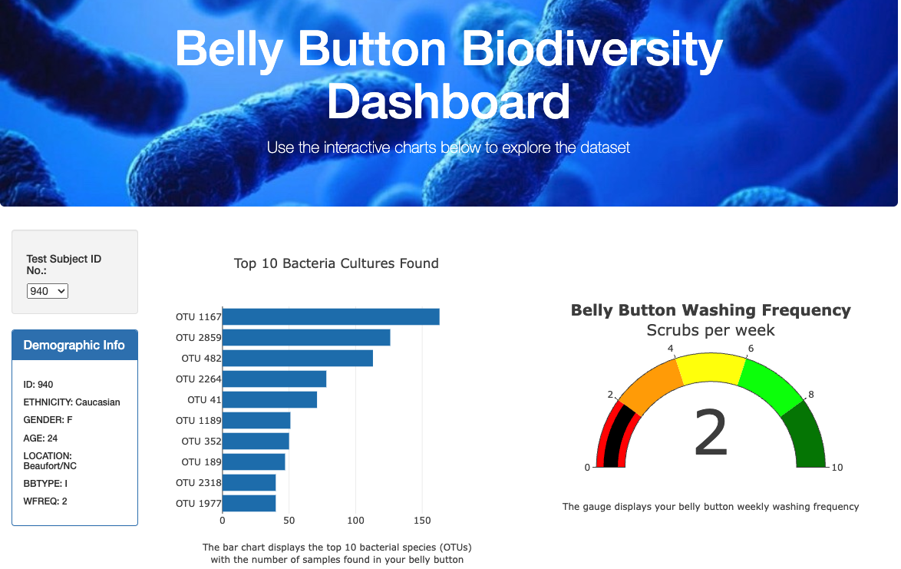

# Belly_Button_Biodiversity
## 1. Overview of Project
This project focuses on building dynamic dashboard to analyze human navel bacteria using JavaScript, Plotly, D3, HTML, CSS, and Bootstrap.

  

